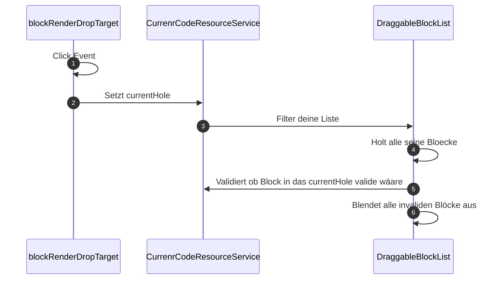
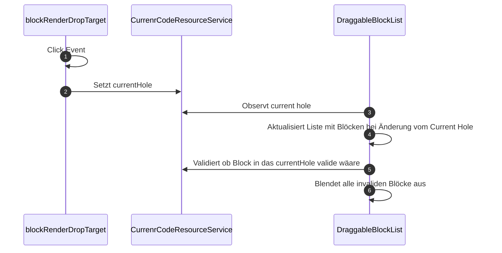
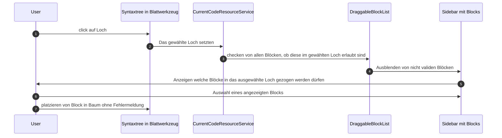

```mermaid
sequenceDiagram
    autonumber
    participant blockRenderDropTarget
    participant CurrenrCodeResourceService
    participant DraggableBlockList

    blockRenderDropTarget->>blockRenderDropTarget: Click Event
    blockRenderDropTarget->>CurrenrCodeResourceService: Setzt currentHole
    CurrenrCodeResourceService->>DraggableBlockList: Filter deine Liste
    DraggableBlockList->>DraggableBlockList: Holt alle seine Bloecke
    DraggableBlockList->>CurrenrCodeResourceService: Validiert ob Block in das currentHole valide wäare
    DraggableBlockList->>DraggableBlockList: Blendet alle invaliden Blöcke aus
```

```mermaid
sequenceDiagram
    autonumber
    participant blockRenderDropTarget
    participant CurrenrCodeResourceService
    participant DraggableBlockList

    blockRenderDropTarget->>blockRenderDropTarget: Click Event
    blockRenderDropTarget->>CurrenrCodeResourceService: Setzt currentHole
    DraggableBlockList->>CurrenrCodeResourceService: Observt current hole
    DraggableBlockList->>DraggableBlockList: Aktualisiert Liste mit Blöcken bei Änderung vom Current Hole
    DraggableBlockList->>CurrenrCodeResourceService: Validiert ob Block in das currentHole valide wäare
    DraggableBlockList->>DraggableBlockList: Blendet alle invaliden Blöcke aus
```

```mermaid
sequenceDiagram
    autonumber
    participant User
    participant Syntaxtree in Blattwerkzeug
    participant CurrentCodeResourceService
    participant DraggableBlockList
    participant Sidebar mit Blocks

    User->>Syntaxtree in Blattwerkzeug: click auf Loch
    Syntaxtree in Blattwerkzeug->>CurrentCodeResourceService: Das gewählte Loch setzten
    CurrentCodeResourceService->>DraggableBlockList: checken von allen Blöcken, ob diese im gewählten Loch erlaubt sind
    DraggableBlockList->>Sidebar mit Blocks: Ausblenden von nicht validen Blöcken
    Sidebar mit Blocks->>User: Anzeigen welche Blöcke in das ausgewählte Loch gezogen werden dürfen
    User->>Sidebar mit Blocks: Auswahl eines angezeigten Blocks
    User->>Syntaxtree in Blattwerkzeug: platzieren von Block in Baum ohne Fehlermeldung
```