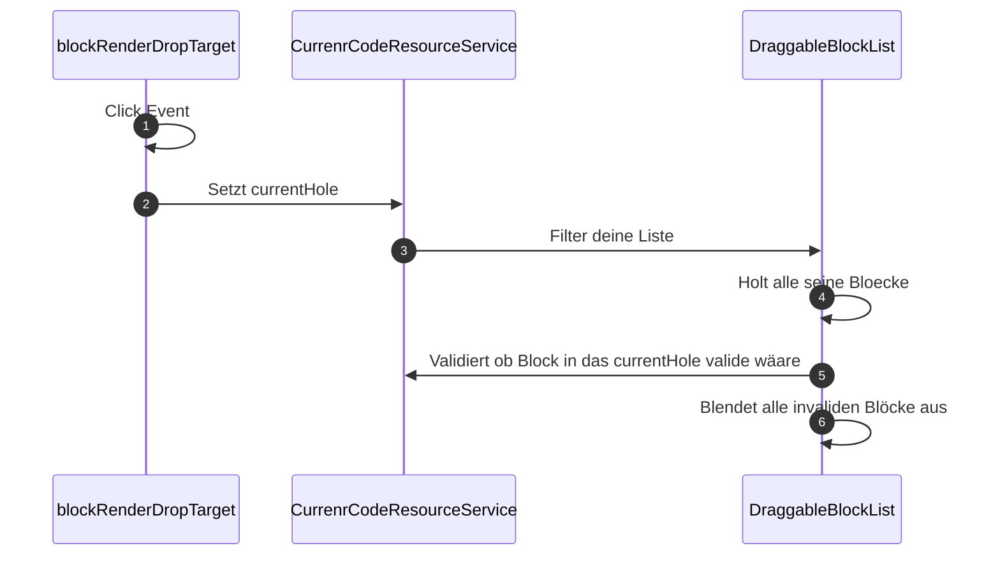
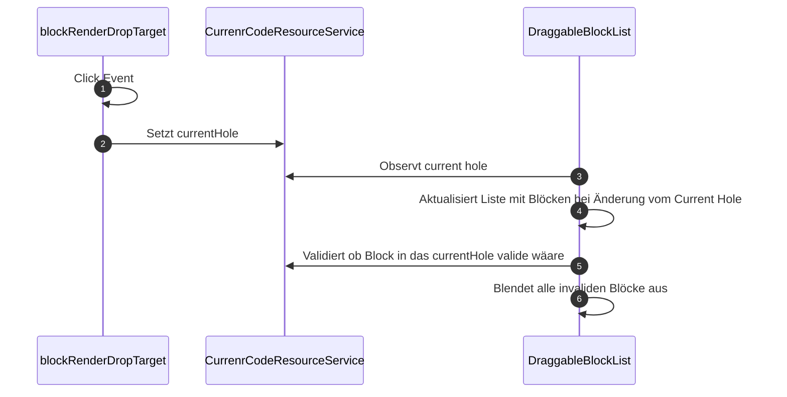

```mermaid
sequenceDiagram
    autonumber
    participant blockRenderDropTarget
    participant CurrenrCodeResourceService
    participant DraggableBlockList

    blockRenderDropTarget->>blockRenderDropTarget: Click Event
    blockRenderDropTarget->>CurrenrCodeResourceService: Setzt currentHole
    CurrenrCodeResourceService->>DraggableBlockList: Filter deine Liste
    DraggableBlockList->>DraggableBlockList: Holt alle seine Bloecke
    DraggableBlockList->>CurrenrCodeResourceService: Validiert ob Block in das currentHole valide wäare
    DraggableBlockList->>DraggableBlockList: Blendet alle invaliden Blöcke aus
```

```mermaid
sequenceDiagram
    autonumber
    participant blockRenderDropTarget
    participant CurrenrCodeResourceService
    participant DraggableBlockList

    blockRenderDropTarget->>blockRenderDropTarget: Click Event
    blockRenderDropTarget->>CurrenrCodeResourceService: Setzt currentHole
    DraggableBlockList->>CurrenrCodeResourceService: Observt current hole
    DraggableBlockList->>DraggableBlockList: Aktualisiert Liste mit Blöcken bei Änderung vom Current Hole
    DraggableBlockList->>CurrenrCodeResourceService: Validiert ob Block in das currentHole valide wäare
    DraggableBlockList->>DraggableBlockList: Blendet alle invaliden Blöcke aus
```