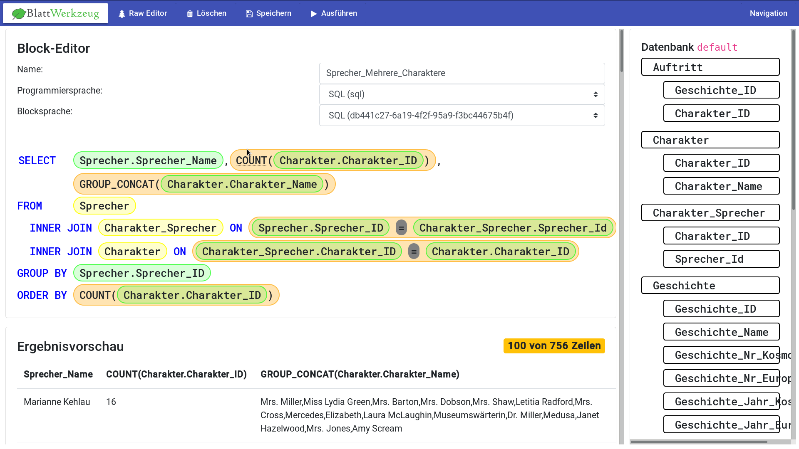

Vorhaben: Generierung von syntaxfreien Programmierumgebungen für beliebige Programmiersprachen
==============================================================================================

Konventionelle Entwicklungsumgebungen sind speziell auf die Bedürfnisse von professionellen Anwendern zugeschnittene Programme. Aufgrund der damit verbundenen Komplexität sind sie aus didaktischer Sicht nicht für die Einführung in die Programmierung geeignet. Im Rahmen der Promotion soll erforscht und praktisch demonstriert werden, wie sich aus formalen Beschreibung von Programmiersprachen benutzerfreundliche Programmierumgebungen erzeugen lassen können. Bei diesen formalen Beschreibungen handelt es sich um eine noch nicht endgültig spezifizierte Abwandlung "typischer" Grammatiken wie sie zur Definition der Syntax in jedem Übersetzer von Quelltexten zum Einsatz kommen.

Ein Beispiel für eine solche automatisch generierte Oberfläche :numref:`_example_generated_editor`

.. _example_generated_editor:

Zentrale Begriffe und Zusammenhänge
-----------------------------------

Praktisches Vorhaben
--------------------

Der praktische Teil des Promotionsvorhabens befasst sich mit der Entwicklung einer Software, welche theoretisch auch im Unterricht an Schulen zum Einsatz kommen könnte. Die primäre Zielgruppe sind damit Schülerinnen und Schüler sowie deren Lehrkräfte.

Theoretische Fragestellungen
----------------------------

Untersucht werden dabei die folgenden Fragen:

* Inwiefern