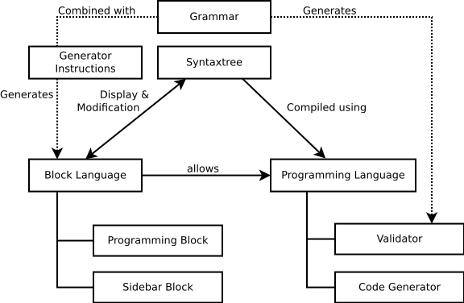

***************
 Core Concepts
***************

Conventional development environments are programs that are tailored to suit the needs of professionals. Due to their complexity they do not lend themselves well to introduce pupils to programming. BlattWerkzeug is a tool that is geared towards "serious learners" and is intended to be used with support from teachers or some similar form of supervision.

To eliminate the possibility of syntactical errors while programming, the elements of the programming- or markup-languages are represented by graphical blocks, similar to the approach taken by the software `Scratch <https://scratch.mit.edu/>`_. These blocks can be combined by using drag & drop operations.

The current aim is to provide an environment for the following programming languages:

* ``SQL`` and databases in general. This explicitly includes the generation and modification of schemas.
* ``HTML`` and ``CSS`` to generate web pages.
* A ``HTML``-dialect that supports basic algorithmic structures like conditionals and loops.
* A "typical" imperative programming language.
* Regular Expressions.

Block & Programming Languages
=============================

   Relations of syntaxtrees, block- and programming-languages.

At the very core, there are four different structures involved when a program is edited with a block editor:

* The **grammar** defines the basic structure of an abstract syntax tree that may be edited. It may be used to automatically generate block languages and validators.
* The **abstract syntax tree** represents the structure of the code that is via the **block editor**. In a conventional system this can be thought of as a "file".
* The block editor know how to represent the "file" because it uses a **block language** which controls how the syntaxtree is layouted and which blocks are available in the sidebar.
* The actual compilation and validation is done by a **programming language**.

For everyday users this distinction is not relevant at all. They only ever interact with "files" that make use of certain block languages.

Advanced users like teachers may adapt existing block languages (or even create entirely new ones) to better suit the exact requirements of their classroom. Especially removing functionality from block languages should be a relatively trivial operation. So having a variant of the SQL block language

The creation or adaption of existing block languages languages should be "easy", at least for the targeted audiences: Programmers with a background in compiler construction should "easily" be able to add new languages and teachers with a little bit of programming experience should "easily" be able to tweak existing languages to their liking.

Projects
========

All work in BlattWerkzeug is done in the scope of so called "projects". Projects are the main category of work and have at least a name and a user friendly description. Apart from that they bundle together various resources and assets such as databases, images and code.
