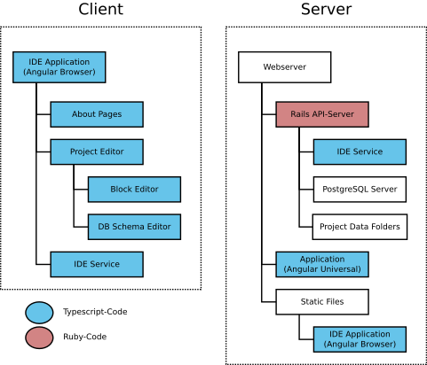

===================
 Project Structure
===================

  High-level overview about different client and server components.

At its core the project consists of two codebases:

* A Ruby-server that uses Rails (found under ``server``).
* A single page browser application that uses Typescript and Angular (found under ``client``). This source code can be compiled in three different variants: ``browser``, ``universal`` and ``ide-service``.

But looking into it with more detail, the participating systems are responsible for the following tasks:

IDE Application (Browser)
  The "typical" browser application. This is the code that handles the actual user interaction like drag & drop events.

IDE Application (Universal)
  This variant of the application is basically a ``node.js``-compatible version of the browser application which can be run on the server. This is used to speed up initial page loading and to be at least a little bit SEO-friendly. And apart from that it allows the non-IDE pages to be usable without JavaScript enabled.
  
IDE Service
  A commandline application that reads ``JSON``-messages from ``stdin`` and outputs matching ``JSON``-responses. This service ensures that server and client can run the exact same validation and compile operations without the need for any network roundtrips.

Webserver
  Although it is possible to run a server instance without dedicated webserver, this is strongly discouraged. The webserver should serve static files (like the compiled client), and route requests to the "Universal" application and the API-Server.

Rails API-Server
  This server acts as the storage backend: Clients store and retrieve the data of their projects via a ``REST``-endpoints. The actual data is stored in the database and the filesystem and separated into three different environments: ``production``, ``development`` and ``test``, no data is shared between these environments. Additionally the server carries out operations that can't be done on the client, mainly database operations.

PostgreSQL Server
  The database stores most of the project data, basically everything besides from file assets like images and ``.sqlite``-databases.

Project Data Folders
  Actual files, like images and ``.sqlite``-databases are stored in the filesystem.
